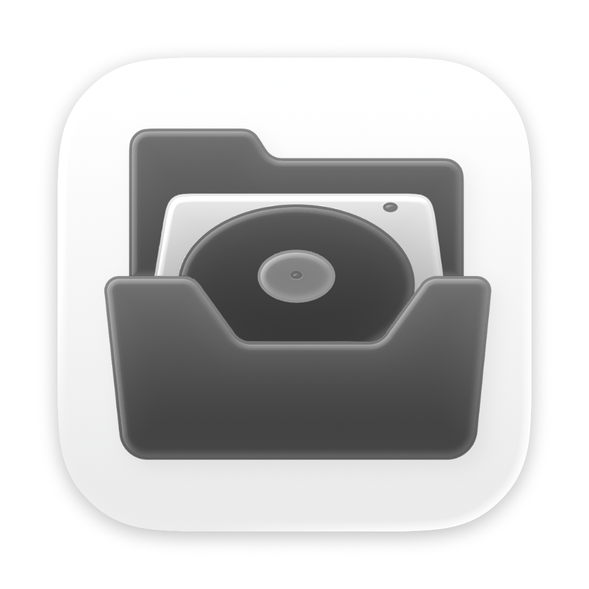
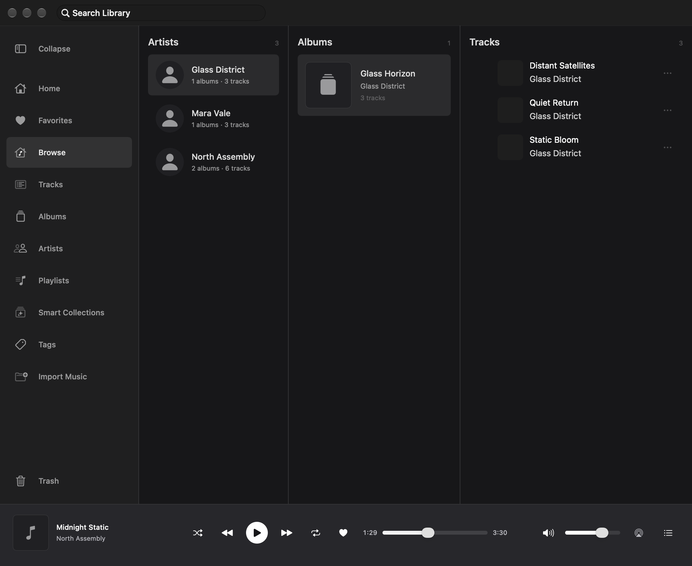
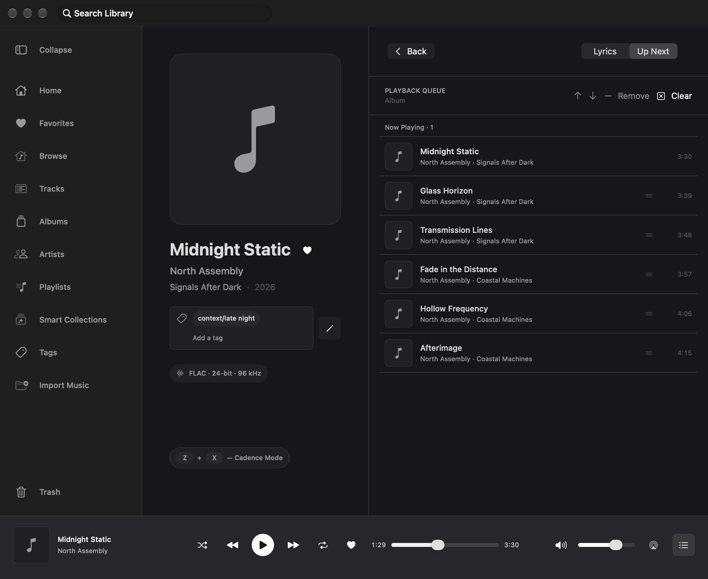
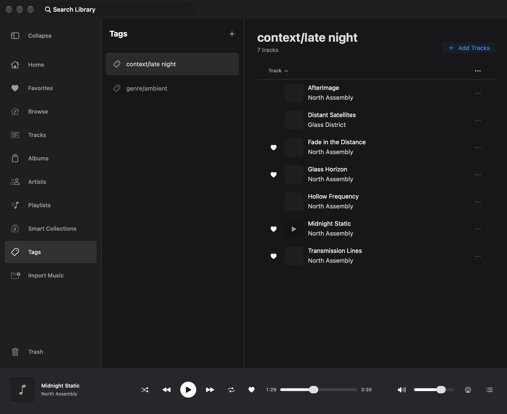
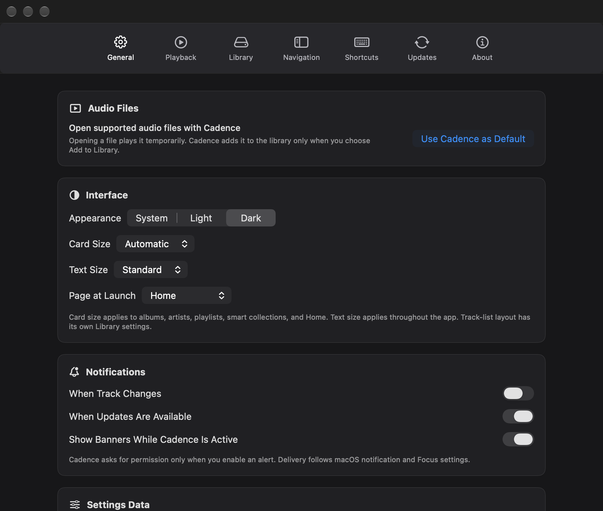

<p align="center">
  
</p>

<h1 align="center">Cadence</h1>

<p align="center">
  A native macOS player and library manager for music you keep locally.
</p>

<p align="center">
  <a href="LICENSE"></a>
  
  
  
</p>

<p align="center">
  <a href="#interface">Interface</a> ·
  <a href="#features">Features</a> ·
  <a href="#quick-start">Quick start</a> ·
  <a href="#documentation">Documentation</a>
</p>

Cadence imports local audio into a managed library, keeps the source files
untouched, and puts playback, lyrics, tags, playlists, and smart collections in
one native SwiftUI app. Its managed folder lives on this Mac or a connected
local drive chosen by the user.

> [!IMPORTANT]
> Cadence 0.2.0 Beta 1 (2) is an Apple silicon release candidate. No binary
> from this branch is ready for publication until it is signed with Developer
> ID, accepted by Apple's notary service, stapled, and passes the installation
> acceptance checklist. It is not an App Store release.

## Interface

The screenshots below come from Cadence's production UI rendered against an
isolated in-memory SwiftData fixture. Every artist, album, track, and tag is
synthetic; the capture process cannot open the developer's music library.



<table>
  <tr>
    <td width="50%">
      
    </td>
    <td width="50%">
      
    </td>
  </tr>
  <tr>
    <td align="center"><strong>Listen and follow lyrics</strong></td>
    <td align="center"><strong>Organize without changing files</strong></td>
  </tr>
</table>



## Features

### Managed local library

- Import individual audio files, folders, or Finder drops.
- Review duplicates before Cadence copies anything.
- Preserve original files and store managed media under stable track IDs.
- Link a same-folder `.lrc` file when its normalized basename matches the audio
  file.
- Move tracks, albums, or artists to Cadence Trash and restore them later.
- Keep the catalog, artwork, lyrics, and original media together in the local
  Cadence folder.

### Native playback

- Open registered AAC, AIFF, FLAC, M4A, MP3, and WAV files from Finder in a
  temporary queue without importing or scanning nearby folders.
- Choose **Add to Library…** to send only the current external file through the
  normal scan and duplicate-review flow.
- Play supported lossless stereo through an `AVAudioEngine` PCM path.
- Fall back to the system player for formats and routes that need native
  handling.
- Control playback from the app, media keys, Control Center, queue, and Now
  Playing.
- Inspect the source format, sample rate, channel count, selected backend, and
  output route.
- Use a direct PCM path whenever the format and output support it, with
  automatic native fallback for compatible system routes and formats.

### Browse and organize

- Browse all tracks, albums, artists, tags, playlists, and smart collections.
- Learn the interface through a first-run welcome and replayable Help chapters.
- Sort track-table columns while Cadence keeps their widths stable.
- Assign hierarchical tags such as `genre/ambient` or standalone tags such as
  `childhood`.
- Build smart collections from nested rules without changing track metadata.
- Search the library and follow contextual links between tracks, albums,
  artists, and tags.

### Lyrics and artwork

- Read line-timed LRC lyrics and seek by selecting a line.
- Edit text and line timestamps in the built-in Lyrics Editor.
- Import, crop, replace, or remove track, album, and artist artwork.

## Quick start

### Install the beta

The public beta has not been published yet. When the signed and notarized
[`Cadence-0.2.0-beta.1-arm64.dmg`](https://github.com/QenTerra/cadence/releases/tag/v0.2.0-beta.1)
appears on the official release page, open it and drag Cadence to the visible
**Applications** alias. Do not redistribute the ad-hoc artifact produced by
the local packaging mode.

### Requirements

- macOS 26 or later
- Xcode 27 or later with a compatible macOS SDK
- Homebrew
- Apple silicon Mac for the documented local test destination

### Build from source

```sh
git clone https://github.com/QenTerra/cadence.git
cd cadence
brew bundle
./scripts/prepare_python_tools.sh
xcodegen generate --spec project.yml
open Cadence.xcodeproj
```

Select the `Cadence` scheme and run it on **My Mac**.

Run the complete local gate before submitting a change. The declared Python
environment is required for deterministic DMG image validation:

```sh
./scripts/prepare_python_tools.sh
bash scripts/verify.sh
```

GitHub Actions regenerates the project and runs SwiftFormat and SwiftLint.
The hosted macOS runner currently provides Xcode 26.6, so the complete build
and test gate must be run locally with Xcode 27 until GitHub adds a compatible
toolchain.

`project.yml` is the source of truth for Xcode configuration. Regenerate the
committed `Cadence.xcodeproj` after changing targets, files, entitlements, or
build settings.

## Permissions and privacy

Cadence does not contain analytics, ads, tracking, or an account system. Remote
media stays disconnected until you explicitly configure WebDAV or Google Drive
in Settings. When connected, Cadence uses the selected provider only to read
the remote library manifest and transfer the media needed for playback; it does
not send your local library or listening activity to QenTerra. Credentials and
Google OAuth state stay in Keychain, while remote audio uses a bounded local
cache. Cadence does not synchronize the managed library through iCloud.
External project links open only when you select one in Settings.

The selected Cadence folder contains managed audio, artwork, lyrics, Trash,
and recovery records. Its SwiftData catalog and derived search index remain in
the sandboxed Application Support directory, keyed by the folder's stable
library identity. Moving the folder therefore does not move a live SQLite
database onto a removable disk or file-provider volume.

- [Privacy](PRIVACY.md)
- [Terms of Use](TERMS_OF_USE.md)
- [Security](SECURITY.md)
- [Third-party notices](THIRD_PARTY_NOTICES.md)

You are responsible for using audio, artwork, metadata, and lyrics you have the
right to copy and play.

## Development

### Project structure

```text
Sources/Cadence/
  App/             Application state and feature coordination
  Components/      Shared SwiftUI components
  DesignSystem/    Theme, surfaces, typography, and motion
  Features/        Library, playback, tags, playlists, import, and settings
  Foundation/      App configuration and shared infrastructure
  Import/          Scan, review, copy, manifest, and recovery pipeline
  ManagedLibrary/  Cadence folder paths and managed operations
  Models/          Domain and presentation values
  Persistence/     SwiftData schema, repository, and paged store
  Playback/        Coordinator, audio backends, routing, and media controls
Tests/CadenceTests/ Unit and integration tests
```

Read the [architecture](docs/ARCHITECTURE.md),
[build guide](docs/BUILDING.md), [dependency policy](docs/DEPENDENCIES.md), or
the [GitHub Wiki](https://github.com/QenTerra/cadence/wiki) for more detail.

## Current limitations

- The first binary beta is Apple silicon only; publication remains blocked
  until Developer ID signing, notarization, stapling, and clean-machine
  installation acceptance all pass.
- Intel and universal binaries are not included in `0.2.0-beta.1`.
- The complete Xcode 27 build and test gate remains local while the hosted
  GitHub runner provides an older toolchain.
- Output-device behavior, long playback, VoiceOver, spatial audio, and large
  real libraries remain hardware or manual release gates.

## Documentation

- [Complete product and engineering Wiki](https://github.com/QenTerra/cadence/wiki)
- [Documentation index](docs/README.md)
- [Building from source](docs/BUILDING.md)
- [Architecture](docs/ARCHITECTURE.md)
- [Dependencies](docs/DEPENDENCIES.md)
- [Troubleshooting](docs/TROUBLESHOOTING.md)
- [UI system](docs/UI_SYSTEM.md)
- [Contributing](CONTRIBUTING.md)
- [Changelog](CHANGELOG.md)
- [Privacy Policy](PRIVACY.md)
- [Terms of Use](TERMS_OF_USE.md)
- [Security Policy](SECURITY.md)
- [Third-party notices](THIRD_PARTY_NOTICES.md)
- [MIT License](LICENSE)

## Support

Cadence is created and maintained by
[Nikita Melnychenko (QenTerra)](https://github.com/QenTerra).

Bug reports and focused pull requests are welcome. Read
[CONTRIBUTING.md](CONTRIBUTING.md) before opening one. Report security issues
through the private route in [SECURITY.md](SECURITY.md).

## License

Cadence source code is available under the [MIT License](LICENSE).
