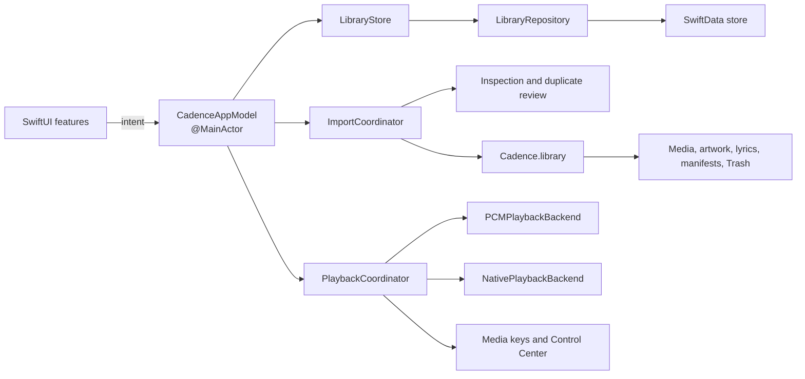

# Architecture

Cadence is a sandboxed SwiftUI application using Swift 6 strict concurrency,
SwiftData, AVFoundation, and native macOS media services.

## Runtime flow



Views render observable state and call model intents. They do not write managed
media, mutate SwiftData, or configure audio engines directly.

## Application state

`CadenceAppModel` is the main-actor application orchestrator. Extensions divide
library navigation, tags, smart collections, playlists, import, playback,
lyrics, artwork, search, and contextual navigation into feature files.

Production starts with `CadenceAppModel.production(librarySession:)`. Debug and
Release launches use the same production-backed runtime; there is no hidden
preview argument in the application target. Unit tests retain isolated fixture
models for domain behavior, and documentation screenshots render through an
opt-in test harness backed by an in-memory SwiftData repository.

## Persistence

`LibraryRepository` owns the SwiftData model container and migrations.
`LibraryStore` provides paged catalog access and derived counts to the UI.
Production state does not load the complete music library into a second
in-memory cache.

The current schema stores tracks, albums, artists, artwork, tags, assignments,
exclusions, playlists, smart collections, lyrics references, playback fields,
and Trash metadata.

## Managed library

The default package is:

```text
~/Music/Cadence.library
```

```text
Cadence.library/
  Media/
  Lyrics/
  Artwork/
  Metadata/
  Staging/
  Trash/
```

Import inspection is read-only. Confirmed work enters `Staging`, validates
copied content, writes the SwiftData transaction, and moves complete artifacts
into their managed locations. A durable manifest supports recovery or rollback.
Original source files remain untouched.

## Playback

`PlaybackCoordinator` owns the canonical queue and playback state.

- `PCMPlaybackBackend` uses `AVAudioEngine` for supported stereo PCM and
  lossless files.
- `NativePlaybackBackend` preserves system handling for other compatible files,
  multichannel content, and system routes.
- `PlaybackRoutingPolicy` selects a backend from file capabilities, output
  route, and the Adaptive, Pure, or Immersive profile.
- `SystemMediaSession` connects media keys and Control Center to the same state.

UI controls, lyrics timing, Now Playing, and the queue observe the coordinator
instead of maintaining competing clocks.

## Concurrency

- UI-observable state stays on the main actor.
- Repositories, import work, hashing, metadata inspection, and playback
  backends isolate mutable work behind explicit boundaries.
- Values crossing concurrency boundaries conform to `Sendable` where required.
- Import and playback work propagate cancellation.

## Project generation

`project.yml` is the Xcode project source of truth. The generated
`Cadence.xcodeproj` is committed so a contributor can open it immediately.

```sh
xcodegen generate --spec project.yml
```

Regenerate before checking the project into Git.
