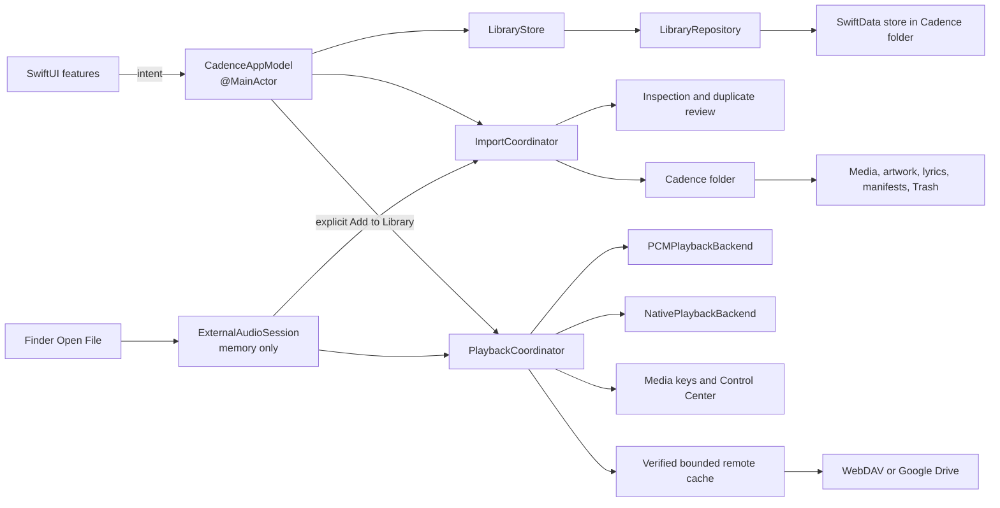

# Architecture

Cadence is a sandboxed SwiftUI application using Swift 6 strict concurrency,
SwiftData, AVFoundation, and native macOS media services.

## Runtime flow



Views render observable state and call model intents. They do not write managed
media, mutate SwiftData, or configure audio engines directly.

## Application state

`CadenceAppModel` is the main-actor application orchestrator. Extensions divide
library navigation, tags, smart collections, playlists, import, playback,
lyrics, artwork, search, and contextual navigation into feature files.

Production starts with `CadenceAppModel.production(librarySession:)`. Debug and
Release launches use the same production-backed runtime; there is no hidden
preview argument in the application target. Unit tests retain isolated fixture
models for domain behavior, and documentation screenshots render through an
opt-in test harness backed by an in-memory SwiftData repository.

## Persistence

`LibraryRepository` owns the SwiftData model container and migrations.
`LibraryStore` provides paged catalog access and derived counts to the UI.
Production state does not load the complete music library into a second
in-memory cache. The live SwiftData store stays inside the managed Cadence
folder and is the single canonical catalog.

The current schema stores tracks, albums, artists, artwork, tags, assignments,
exclusions, playlists, smart collections, lyrics references, playback fields,
and Trash metadata.

## Managed library

The default folder is:

```text
~/Music/Cadence
```

```text
Cadence/
  Media/
  Lyrics/
  Artwork/
  Metadata/
  Staging/
  Trash/
```

Import inspection is read-only. Confirmed work enters `Staging`, validates
copied content, writes the SwiftData transaction, and moves complete artifacts
into their managed locations. A durable manifest supports recovery or rollback.
Original source files remain untouched.

The package location is persisted as a security-scoped bookmark and may point
to this Mac or a connected local drive. Stale bookmarks are refreshed after
successful resolution. The package's stable library identity prevents a moved
folder from being mistaken for a different library.

## Playback

`PlaybackCoordinator` owns the canonical queue and playback state.

- `PCMPlaybackBackend` uses `AVAudioEngine` for supported stereo PCM and
  lossless files.
- `NativePlaybackBackend` preserves system handling for other compatible files,
  multichannel content, and system routes.
- `PlaybackRoutingPolicy` selects a backend from file capabilities and output
  route, using direct PCM whenever it is compatible.
- `SystemMediaSession` connects media keys and Control Center to the same state.

UI controls, lyrics timing, Now Playing, and the queue observe the coordinator
instead of maintaining competing clocks.

Finder Open File events enter an ordered `ExternalAudioSession`. It resolves
only the exact registered files into a transient playback queue, retains their
security-scoped access for that session, and never writes catalog records or
scans sibling folders. `CompositePlaybackTrackResolver` lets that queue use the
normal playback backends. The explicit **Add to Library…** action passes only
the current file to the existing import inspection and duplicate-review flow.

Remote libraries keep the live SwiftData catalog local. The provider-neutral
manifest maps track IDs to immutable media objects. WebDAV and Google Drive
adapters use conditional manifest revisions so concurrent changes fail closed.
Playback downloads the current object to staging, verifies its size and
SHA-256, atomically promotes it into a bounded LRU cache, and only then gives a
local URL to the existing backends. Current and next tracks are pinned; stale
prefetch work is cancelled. Credentials and OAuth state stay in Keychain. The
Google adapter keeps the narrow `drive.file` scope and therefore accepts only
objects created by Cadence under the same OAuth client.

## Concurrency

- UI-observable state stays on the main actor.
- Repositories, import work, hashing, metadata inspection, and playback
  backends isolate mutable work behind explicit boundaries.
- Values crossing concurrency boundaries conform to `Sendable` where required.
- Import and playback work propagate cancellation.

## Project generation

`project.yml` is the Xcode project source of truth. The generated
`Cadence.xcodeproj` is committed so a contributor can open it immediately.

```sh
xcodegen generate --spec project.yml
```

Regenerate before checking the project into Git.
